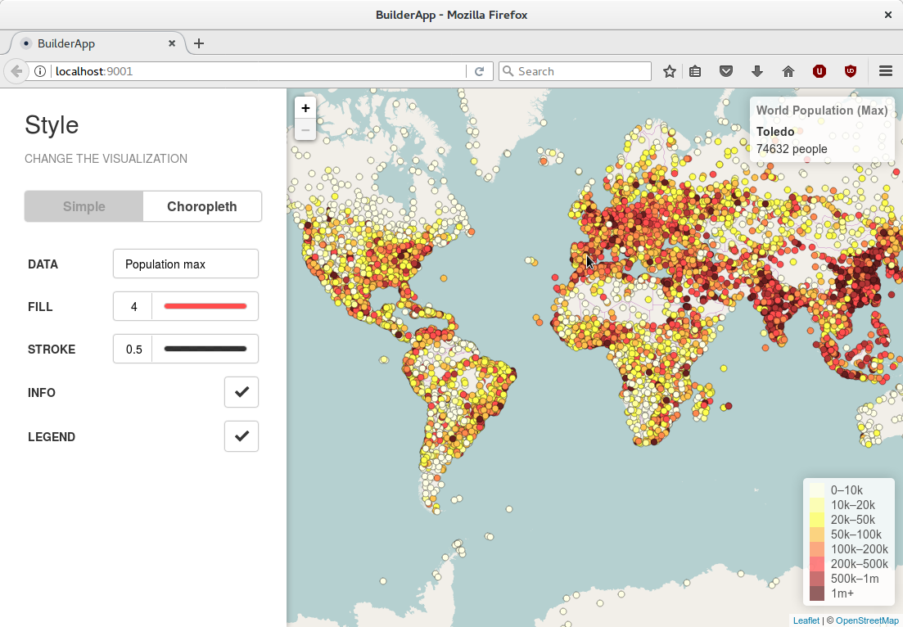

# Builder App

This application is written in **JavaScript ES5** using the Leaflet map library. It provides an example web application for the **Styler and Dropzone components**.


## Quick start

1. Download [this](https://xavijam.carto.com/api/v2/sql?q=SELECT%20*%20FROM%20ne_10m_populated_places_simple&format=GeoJSON) GeoJSON file
2. Drag and drop the file into the map
3. Edit the controls to style the markers and other elements!



Tested in:
* Mozilla Firefox 54.0
* Chromium 59.0

## Development

### Styler component

```html
<link rel="stylesheet" href="styles/styler.css">
<script src="scripts/styler.js"></script>
```

```html
<div id="styler"></div>
<script>
  var styler = S.styler('styler', { ... });
  var panel = S.panel({ ... }).addTo(styler);
  S.sizeColor({ ... }).addTo(panel);
  S.checkBox({ ... }).addTo(panel);
  S.comboBox({ ... }).addTo(panel);
</script>
```

### Dropzone component

```html
<link rel="stylesheet" href="styles/dropzone.css">
<script src="scripts/dropzone.js"></script>
```

```html
<div id="dropzone"></div>
<script>
  var dropzone = new Dropzone('dropzone');
  dropzone.onload = function(data) { ... };
</script>
```

See a working example in `app/scripts/main.js`

### Setup

NPM, bower and gulp are required:

```
$ npm install -g bower gulp-cli
```

```
$ npm install
$ bower install
```

### Run

```
$ gulp serve
$ gulp serve:test
$ gulp serve:dist
```

## Author

* Jesús Arroyo Torrens

## Credits

* [Leaflet](http://leafletjs.com/)
* [Color picker](https://github.com/tovic/color-picker)
* [Please JS](https://github.com/Fooidge/PleaseJS)
